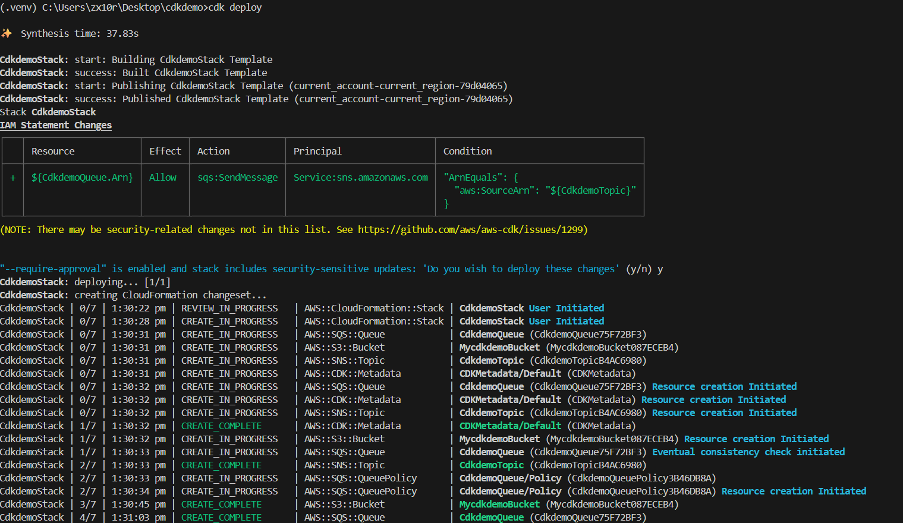
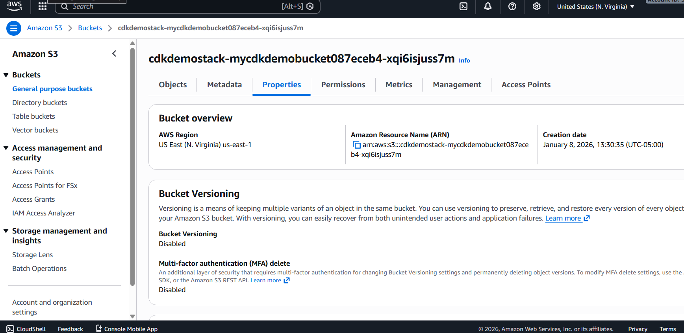

# AWS CDK – Create an S3 Bucket using Python

This project demonstrates how to use **AWS Cloud Development Kit (CDK)** with **Python** to provision an **Amazon S3 bucket** with **KMS encryption**.

## 🧰 Tech Stack
- AWS CDK (Python)
- Amazon S3
- AWS KMS
- AWS CloudFormation
- Python 3.x
- Node.js

## 📁 Architecture
- CDK Stack written in Python
- Infrastructure synthesized into CloudFormation
- Secure S3 bucket with server-side encryption (KMS)

## 🚀 How to Deploy
```bash
# Install dependencies
pip install -r requirements.txt

# Synthesize CloudFormation
cdk synth

# Bootstrap (first time only)
cdk bootstrap

# Deploy stack
cdk deploy

## 📸 Screenshots

### CDK Deploy Output


### S3 Bucket in AWS Console



## ✅ What I learned
- How to initialize and structure an AWS CDK project in Python.
- How `cdk synth`, `cdk bootstrap`, and `cdk deploy` work together with CloudFormation.
- How to provision an S3 bucket with KMS encryption using Infrastructure as Code.
